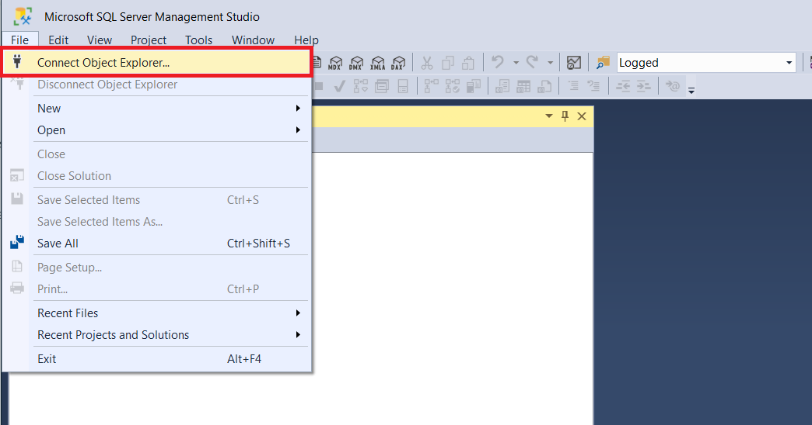
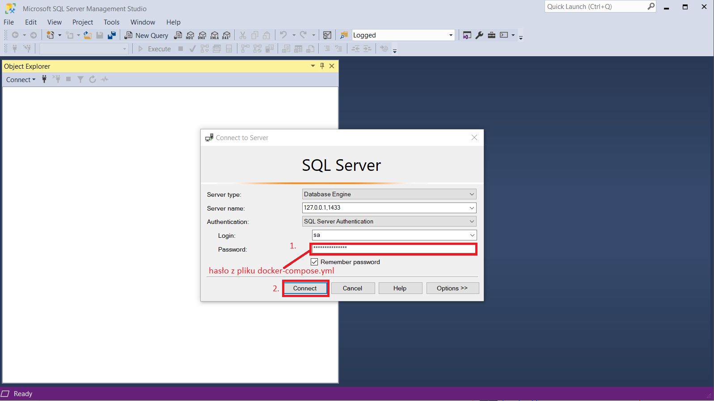

## Nawiązanie połączenia z serwerem baz danych

1. Z menu górnego wybierz *File -> Connect Object Explorer...*

   

1. Wpisz dane do połączenia:
    |||   
    |-----------|---------------|
    |Server name| 127.0.0.1,1433|
    |Authentication| SQL Server Authentication|
    |Login| sa|
    |Password| hasło takie, jakie jest zapisane w pliku *docker-compose.yml* w głównym katalogu repozytorium|

   

1. Kliknij przycisk *Connect*