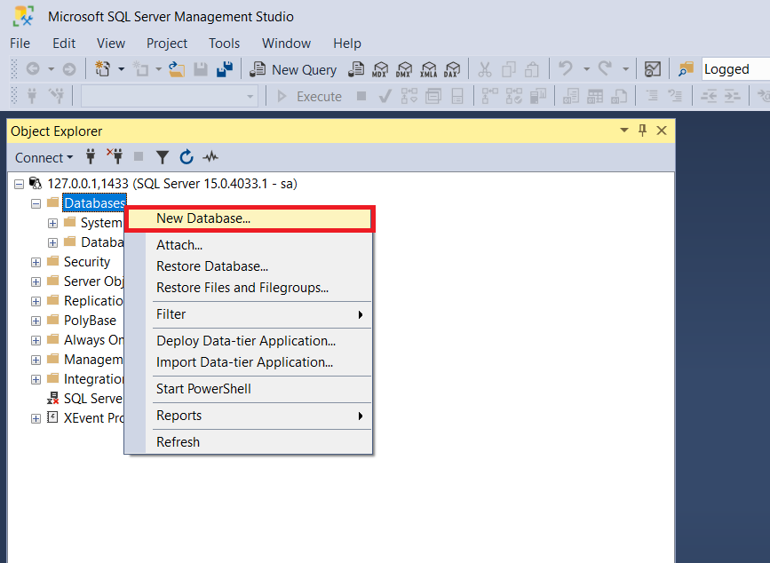
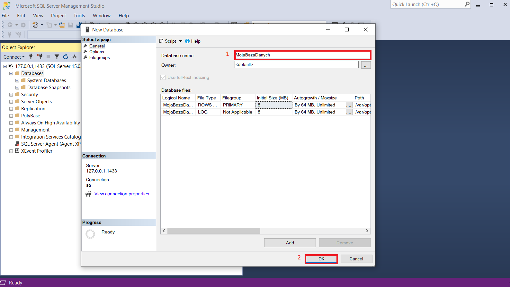

## Tworzenie bazy danych
1. [Uruchom serwer bazy danych](run_db.md)
1. [Uruchom program *SQL Management Studio*](sms.md)
1. [Połącz się ze swoim serwerem baz danych](db_connect.md)
1. Odnajdź w drzewku połączenia z basą węzeł *Databases*, kliknij w niego prawym przyciskiem i wybierz z menu kontekstowego opcję *New Database...*
   
    
1. Wpisz swoją nazwę bazy danych i kliknij przycisk *OK*.

   
Pod węzłem *Databases* powinna pojawić się ikona Twojej bazy danych.