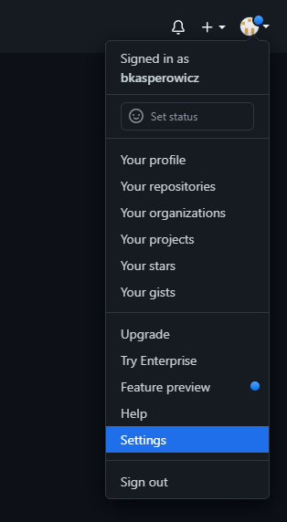

## Przygotowanie środowiska programistycznego na swoim komputerze

### Instalacja narzędzi
Ściągnij i zainstaluj następujące narzędzia:

1. PowerShell 7 - biblioteki windowsowe do terminala

    [Link do pobrania](https://github.com/PowerShell/PowerShell/releases/download/v7.3.0/PowerShell-7.3.0-win-x64.msi)

1.  Cmder - ulepszony terminal z gitem

    [Link do pobrania](https://github.com/cmderdev/cmder/releases/download/v1.3.20/cmder.zip)

    Rozpakuj go do np. katalogu *C:\Work\cmder*

1.  Idea - program do tworzenia programów w Javie

    [Link do pobrania](https://www.jetbrains.com/idea/download/download-thanks.html?platform=windows&code=IIC)

### Ściągnięcie materiałów do nauki z tej strony na swój komputer

Żeby ściągnąć materiały do nauki potrzebne jest wygenerowanie kluczy szyfrujących do komunikacji między Twoim komputerem a GitHubem. Aby to osiągnąć:

1. Otwórz aplikację *cmder*

1. Wpisz w terminalu cmdera polecenie (podmieniając *your_email@example.com* na Twój mail z GitHuba):
    ```
    ssh-keygen -t ed25519 -C "your_email@example.com"
    ```

    Naciskaj *Enter* (zatwierdzając wartości domyślne) do momentu wygenerowania klucza

1. Po wygenerowaniu klucza przejdź do katalogu gdzie klucz się wygenerował, prawdopodobnie będzie to katalog:
*C:\Users\[nazwa Twojego konta Windows]/.ssh* i wyedytuj zawartość pliku o rozszerzeniu *.pub* (np programem *Notatnik*):
    

    Mamy już wygenerowane klucze, w następnych krokach zapiszemy klucz publiczny w githubie:

1. Załóż sobie konto na [GitHubie](https://github.com/)

1. Po zalogowaniu, w prawym górnym rogu rozwiń menu użykownika i wybierz opcję *Settings*

    

1. Będąc w zakładce *Settings* wybierz z menu opcję *SSH and GPG keys*

    

1. Wciśnij przycisk *New SSH key*

    

1. Dodaj swój nowy klucz. W pole Key wpisz zawartość wyedytowanego wcześniej pliku zawierającego klucz publiczny i wciśnij przycisk *Add SSH key*:
    

    W tym momencie GitHub jest w stanie zaufać nam, gdy będziemy ściągać pliki źródłowe do lekcji.

1. Przejdź do repozytorium kodu z lekcjami pod linkiem [https://github.com/bkasperowicz/learn-java](https://github.com/bkasperowicz/learn-java)

1. Kliknij w zielony przycisk *<> Code* - rozwinie się panel z danymi połączenia do tego repozytorium.

1. Kliknij ikonę kopiowania (zaznaczoną na obrazku na czerwono) żeby skopiować link do tego repozytorium

1. Otwórz *cmdera* i przejdź do katalogu w którym chciałbyś trzymać swoje projekty - np w katalogu *C:\Dev\My* :

    

    Ściąga poleceń terminala (w aplikacji cmder):
    ```
    C:           przejście na dysk C
    cd /         Przejście do katalogu głównego na wybranym dysku
    mkdir dev    Stworzenie katalogu "dev" w bierzącym katalogu
    cd dev       Przejście do katalogu "dev" z bierzącego katalogu
    pwd          Wyświetlenie w którym katalogu obecnie się znajduję
    ls           Wyświetlenie zawartości katalogu w którym obecnie się znajduję
    ```
1. Jeśli w cmderze przeszedłeś już do swojego katalogu z projektami (sprawdź poleceniem *pwd* - ściąga powyżej) wpisz polecenie `git clone ` i wklej skopiowany przez Ciebie wcześniej link do repozytorium tzn:
    ```
    git clone git@github.com:bkasperowicz/learn-java.git
    ```

1. Jeśli wpiszesz teraz polecenie `ls` (ściąga powyżej) powinieneś(powinnaś) widzieć że istnieje nowy katalog o nazwie *learn-java*. Jeśli wejdziesz do tego katalogu (poleceniem `cd learn-java` i wpiszesz ponownie polecenie `ls` powinieneś(naś) zobaczyć zawartość tego katalogu), coś w stylu:
    
