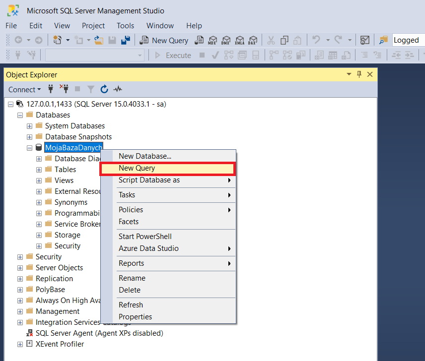
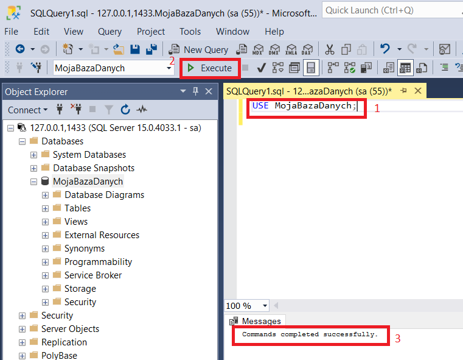

## Pisanie skryptów do operacji na tabelach i danych

Założenie: [stworzyłaś już bazę danych](db_createdb.md)

1. [Uruchom serwer bazy danych](run_db.md)
1. [Uruchom program *SQL Management Studio*](sms.md)
1. [Połącz się ze swoim serwerem baz danych](db_connect.md)
1. Kliknij prawym przyciskiem na węzeł Twojej bazy danych a następnie z menu kontestowego wybierz opcję *New Query*

   
   Pojawi się nowe okienko w którym możesz pisać zapytania (skrypty) do swojej bazy danych
1. Wpisz polecenie:
   ```SQL
   USE <nazwa Twojej bazy danych>;
   ```
   i zatwierdź przyciskiem F5 lub klikając w przycisk *Execute*.

   

    W Oknie o nazwie *Messages* powinien pojawić się komunikat, że zapytanie/polecenie zostało poprawnie wykonane.

1. Wszystkie skrypty/polecenia/zapytania wpisane poniżej linijki
   ```SQL
   USE <nazwa Twojej bazy danych>;
   ```
   zostaną wykonane na Twojej bazie danych. 
   
   Aby uruchomić pojedynczą linijkę zaznacz ją myszką a następnie wciśnij klawisz F5 lub kliknij w przycisk *Execute*